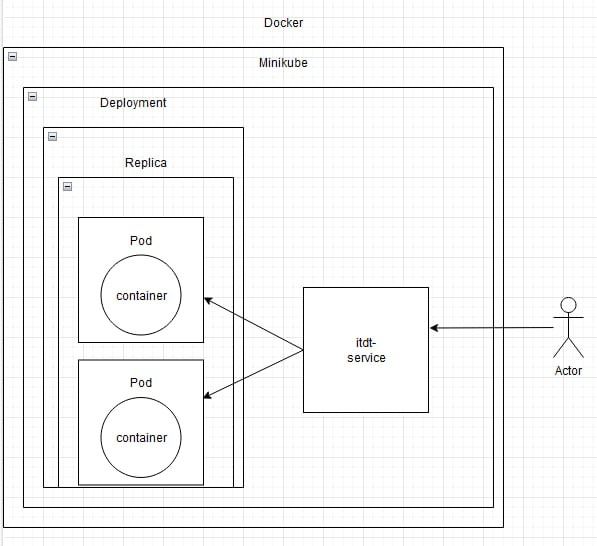

```
University: [ITMO University](https://itmo.ru/ru/) 
Faculty: [FICT](https://fict.itmo.ru) 
Course: [Introduction to distributed technologies](https://github.com/itmo-ict-faculty/introduction-to-distributed-technologies) \
Year: 2024
Group: K4112c
Author: Gruzdev Yaroslav
Lab: Lab2
Date of create: 12.12.2024
Date of finished: 12.12.2024
```

### 1. Run minikube
    $ minikube start

### 2. Apply manifest
Директория содержит в себе файл `deployment.yaml`, в котором описана конфигурация развертывания deployment'а itdt-frontend и сервиса itdt-frontend-service.  
Deployment содержит информацию об использованном образе и порте и создает pod'ы с нашим сервисом.  
Service управляет доступом к pod'ам и позволяет перенаправлять на них запросы.

``` yaml
apiVersion: apps/v1
kind: Deployment
metadata:
  name: itdt-frontend
spec:
  replicas: 2
  selector:
    matchLabels:
      app: itdt-frontend
  template:
    metadata:
      labels:
        app: itdt-frontend
    spec:
      containers:
      - name: itdt-frontend
        image: ifilyaninitmo/itdt-contained-frontend:master
        env:
        - name: REACT_APP_USERNAME
          value: "DeerHolt"
        - name: REACT_APP_COMPANY_NAME
          value: "Robonomics"
        
---

apiVersion: v1
kind: Service
metadata:
  name: itdt-frontend-service
spec:
  selector:
    app: itdt-frontend
  type: NodePort
  ports:
  - protocol: TCP
    port: 80
    targetPort: 80
```

### 3. deployment
    $ kubectl apply -f deployment.yaml
    
### 4. service
    $ kubectl apply -f service.yaml

#### Перенаправление запросов на pod'ы
    $ minikube kubectl -- port-forward service/itdt-frontend-service 8080:80

#### logs
Вывод всех подов:

$ kubectl get pods
NAME                             READY   STATUS    RESTARTS   AGE
itdt-frontend-6869ffc847-q9qjt   1/1     Running   0          21m
itdt-frontend-6869ffc847-smrlw   1/1     Running   0          21m

$ kubectl get service itdt-frontend-service
NAME                    TYPE       CLUSTER-IP     EXTERNAL-IP   PORT(S)        AGE
itdt-frontend-service   NodePort   10.98.237.68   <none>        80:30007/TCP   13m


Вывод логов пода deployment-react-7cccbb6dc5-55xjx:
    
    $ minikube kubectl -- logs deployment-react-7cccbb6dc5-55xjx
    Builing frontend
    Browserslist: caniuse-lite is outdated. Please run:
        npx update-browserslist-db@latest
        Why you should do it regularly: https://github.com/browserslist/update-db#readme
    Browserslist: caniuse-lite is outdated. Please run:
        npx update-browserslist-db@latest
        Why you should do it regularly: https://github.com/browserslist/update-db#readme
    build finished
    Server started on port 3000

Вывод логов пода deployment-react-7cccbb6dc5-5qx7x:

    $ minikube kubectl -- logs deployment-react-7cccbb6dc5-5qx7x
    Builing frontend
    Browserslist: caniuse-lite is outdated. Please run:
        npx update-browserslist-db@latest
        Why you should do it regularly: https://github.com/browserslist/update-db#readme
    Browserslist: caniuse-lite is outdated. Please run:
        npx update-browserslist-db@latest
        Why you should do it regularly: https://github.com/browserslist/update-db#readme
    build finished
    Server started on port 3000


### Схема

