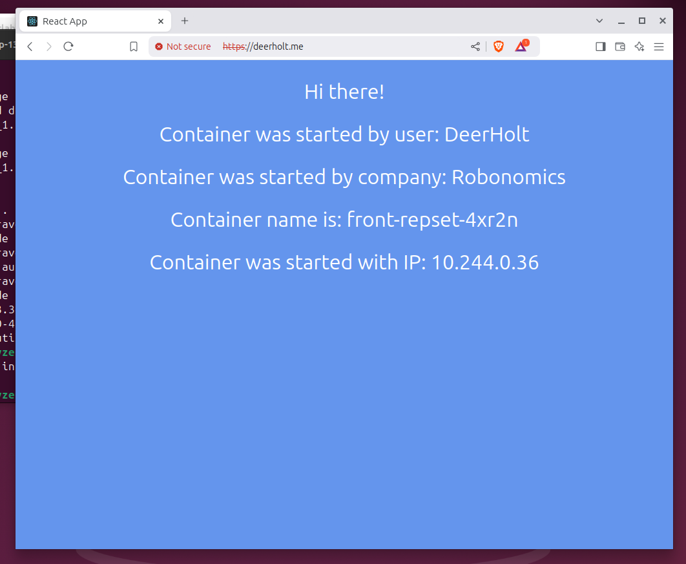
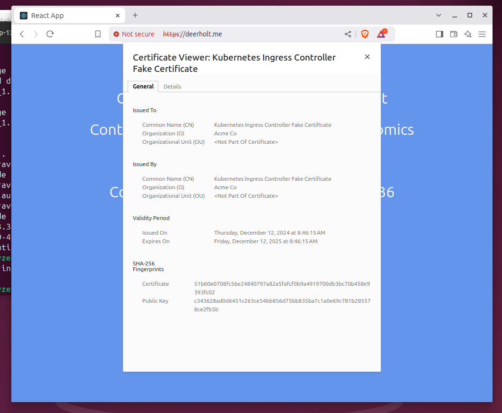
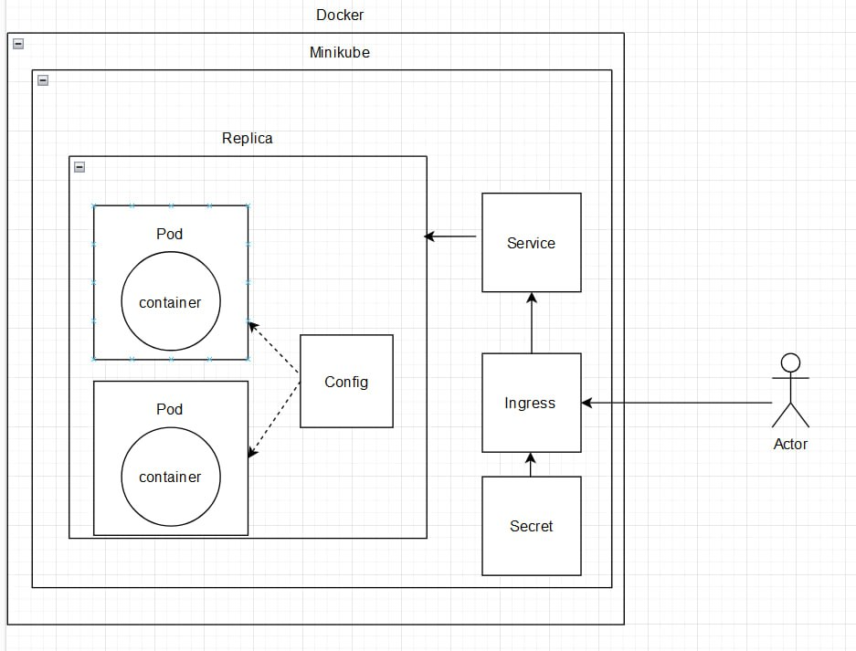

```
University: [ITMO University](https://itmo.ru/ru/) 
Faculty: [FICT](https://fict.itmo.ru) 
Course: [Introduction to distributed technologies](https://github.com/itmo-ict-faculty/introduction-to-distributed-technologies) \
Year: 2024
Group: K4112c
Author: Gruzdev Yaroslav
Lab: Lab3
Date of create: 12.12.2024
Date of finished: 12.12.2024
```

### Запуск Minikube:
```
$ minikube minikube start
```

### Включение Ingress:
```
$ minikube addons enable ingress
```

Ingress - это механизм в Kubernetes, который управляет внешним доступом к службам внутри кластера. Активация Ingress позволяет использовать эту функциональность для маршрутизации внешнего трафика в приложения.

### Создание сертификата:
```
$ openssl req -x509 -nodes -days 365 -newkey rsa:2048 -keyout tls.key -out tls.crt -subj "/CN=xincas.me"
```

После выполнения этой команды создадутся 2 файла `tls.crt` и `tls.key`

## Создаем yaml файл:
apiVersion: v1
kind: ConfigMap
metadata:
  name: app-config
data:
  react_app_username: "DeerHolt"
  react_app_company_name: "Robonomics"


---

apiVersion: apps/v1
kind: ReplicaSet                                            
metadata:
  name: front-repset                   
spec:
  replicas: 2
  selector:
    matchLabels:
      app: itdt-frontend
  template:
    metadata:
      labels:
        app: itdt-frontend
    spec:                                      
      containers:
        - image: ifilyaninitmo/itdt-contained-frontend:master
          name: itdt-frontend                           
          ports:
          - name: react-port
            containerPort: 3000
          env:
            - name: REACT_APP_USERNAME
              valueFrom:
                configMapKeyRef:
                  name: app-config
                  key: react_app_username
            - name: REACT_APP_COMPANY_NAME
              valueFrom:
                configMapKeyRef:
                  name: app-config
                  key: react_app_company_name

---


apiVersion: v1
kind: Service
metadata:
  name: react-service
spec:
  selector:
    app: itdt-frontend
  type: ClusterIP
  ports:
    - port: 3010
      name: react-port
      targetPort: 3000
      protocol: TCP

---

apiVersion: v1
kind: Secret
metadata:
  name: react-tls
type: kubernetes.io/tls
data:
  tls.crt: ...
  tls.key: ...

---

apiVersion: networking.k8s.io/v1
kind: Ingress
metadata:
  name: react-ingress
spec:
  tls:
    - secretName: react-tls
      hosts:
        - deerholt.me
  rules:
    - host: deerholt.me
      http:
        paths:
          - path: /
            pathType: Prefix
            backend:
              service:
                name: react-service
                port:
                  number: 3010

# ip look-up
```
minikube ip
```

## Добавим в файл hosts строку

sudo nano /etc/hosts

```
<Minikube-IP> your.url
```

## Применим файл конфигурации:
```
$ minikube kubectl apply -f d.yaml
```

## Запустим tunnel 
```
$ minikube tunnel
```

Команда minikube tunnel используется для создания сетевого туннеля между вашим локальным кластером Minikube и сетью вашей машины.

## Открываем сайт:


## Сертификат:


## Схема:


## Сommands used:
minikube tunnel
kubectl get nodes
minikube ip
kubectl describe ingress react-ingress
kubectl get replicaset
kubectl get pods
kubectl get configmap app-config -o yaml
kubectl apply -f o.yaml
