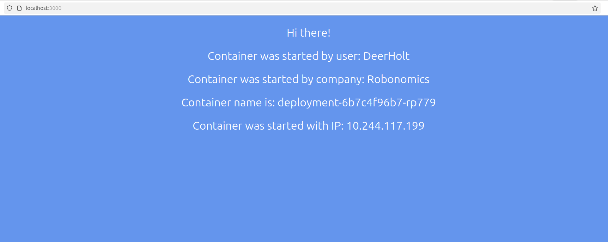
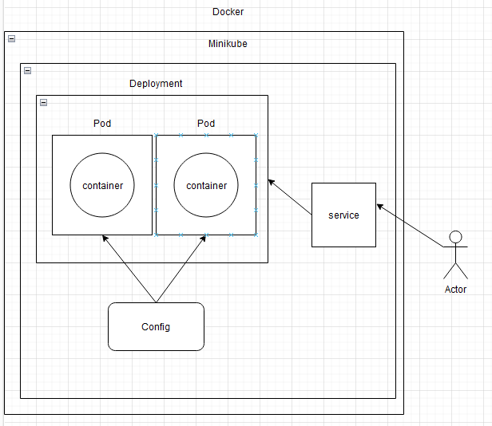

```
University: [ITMO University](https://itmo.ru/ru/) 
Faculty: [FICT](https://fict.itmo.ru) 
Course: [Introduction to distributed technologies](https://github.com/itmo-ict-faculty/introduction-to-distributed-technologies) \
Year: 2024
Group: K4112c
Author: Gruzdev Yaroslav
Lab: Lab4
Date of create: 15.12.2024
Date of finished: 15.12.2024
```

### Запуск Minikube:
```
$ minikube start --network-plugin=cni --cni=calico --nodes 2 -p multinode-demo
```

### Пометка нод:
```
$ kubectl label nodes multinode rack=0
$ kubectl label nodes multinode-m03 rack=1
```

### Установка calicoctl:
```
$ kubectl apply -f https://raw.githubusercontent.com/projectcalico/calico/v3.26.1/manifests/calico.yaml
```

### Создение ippool
```
apiVersion: crd.projectcalico.org/v1
kind: IPPool
metadata:
  name: rack-0
spec:
  cidr: 192.168.10.0/24
  ipipMode: Always
  natOutgoing: true
  nodeSelector: rack == "0"
---
apiVersion: crd.projectcalico.org/v1
kind: IPPool
metadata:
  name: rack-1
spec:
  cidr: 192.168.20.0/24
  ipipMode: Always
  natOutgoing: true
  nodeSelector: rack == "1"
```

```
$ kubectl apply -f myippool.yaml
```
## Создаем yaml файл:
```
apiVersion: apps/v1
kind: Deployment
metadata:
  name: deployment
  labels:
    app: lab4
spec:
  replicas: 2
  selector: 
    matchLabels:
      app: lab4
  template:
    metadata:
      labels:
        app: lab4
    spec:
      containers:
      - name: lab4
        image: ifilyaninitmo/itdt-contained-frontend:master
        env:
        - name: REACT_APP_USERNAME
          value: DeerHolt
        - name: REACT_APP_COMPANY_NAME
          value: Robonomics
        ports:
        - containerPort:  3000
---

apiVersion: v1
kind: Service
metadata:
  name: service-lab4
spec:
  type: NodePort
  selector:
    app: lab4
  ports:
    - port: 3000
      protocol: TCP
      name: http
```
# Применим файлы конфигурации:
```
$ kubectl apply -f deployment.yaml 
$ kubectl apply -f service.yaml 

```

## Проброс порта
```
$ kubectl port-forward service/service-lab4 3000:3000
Forwarding from 127.0.0.1:3000 -> 3000
Forwarding from [::1]:3000 -> 3000
Handling connection for 3000
Handling connection for 3000
```

Переходим по ссылке: http://localhost:8200/

### Ping
Узнаем адрес соседнего пода
```
$ kubectl exec deployment-6b7c4f96b7-rp779 --  nslookup 10.244.117.199
Server:		10.96.0.10
Address:	10.96.0.10:53

199.117.244.10.in-addr.arpa	name = 10-244-117-199.service-lab4.default.svc.cluster.local

$ kubectl exec deployment-6b7c4f96b7-ncl8t --  nslookup 10.244.7.194
Server:		10.96.0.10
Address:	10.96.0.10:53

194.7.244.10.in-addr.arpa	name = 10-244-7-194.service-lab4.default.svc.cluster.local


$ kubectl get pods -o wide
NAME                          READY   STATUS    RESTARTS   AGE   IP               NODE            NOMINATED NODE   READINESS GATES
deployment-6b7c4f96b7-ncl8t   1/1     Running   0          14m   10.244.7.194     multinode-m03   <none>           <none>
deployment-6b7c4f96b7-rp779   1/1     Running   0          14m   10.244.117.199   multinode       <none>           <none>
```

```
$ kubectl exec -it deployment-6b7c4f96b7-ncl8t -- sh
/frontend # ping 10.244.117.199
PING 10.244.117.199 (10.244.117.199): 56 data bytes
64 bytes from 10.244.117.199: seq=0 ttl=62 time=0.796 ms
64 bytes from 10.244.117.199: seq=1 ttl=62 time=0.168 ms
64 bytes from 10.244.117.199: seq=2 ttl=62 time=0.165 ms
64 bytes from 10.244.117.199: seq=3 ttl=62 time=0.170 ms
64 bytes from 10.244.117.199: seq=4 ttl=62 time=0.163 ms
64 bytes from 10.244.117.199: seq=5 ttl=62 time=0.183 ms
64 bytes from 10.244.117.199: seq=6 ttl=62 time=0.199 ms
64 bytes from 10.244.117.199: seq=7 ttl=62 time=0.153 ms
64 bytes from 10.244.117.199: seq=8 ttl=62 time=0.142 ms

$ kubectl exec -it deployment-6b7c4f96b7-rp779 -- sh
/frontend # ping 10.244.7.194 
PING 10.244.7.194 (10.244.7.194): 56 data bytes
64 bytes from 10.244.7.194: seq=0 ttl=62 time=0.313 ms
64 bytes from 10.244.7.194: seq=1 ttl=62 time=0.229 ms
64 bytes from 10.244.7.194: seq=2 ttl=62 time=0.162 ms
64 bytes from 10.244.7.194: seq=3 ttl=62 time=0.191 ms
64 bytes from 10.244.7.194: seq=4 ttl=62 time=0.167 ms
64 bytes from 10.244.7.194: seq=5 ttl=62 time=0.154 ms
64 bytes from 10.244.7.194: seq=6 ttl=62 time=0.133 ms
```

## Cайт:



## Схема:


